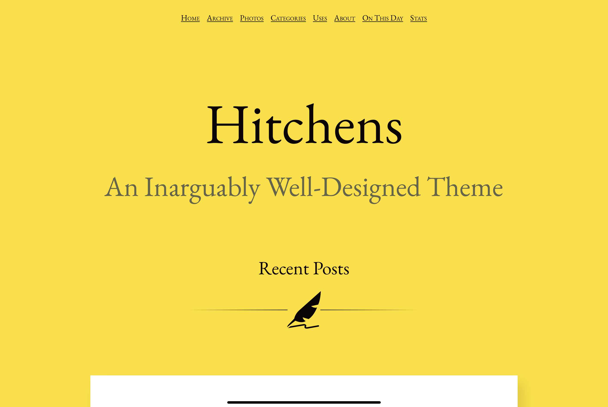
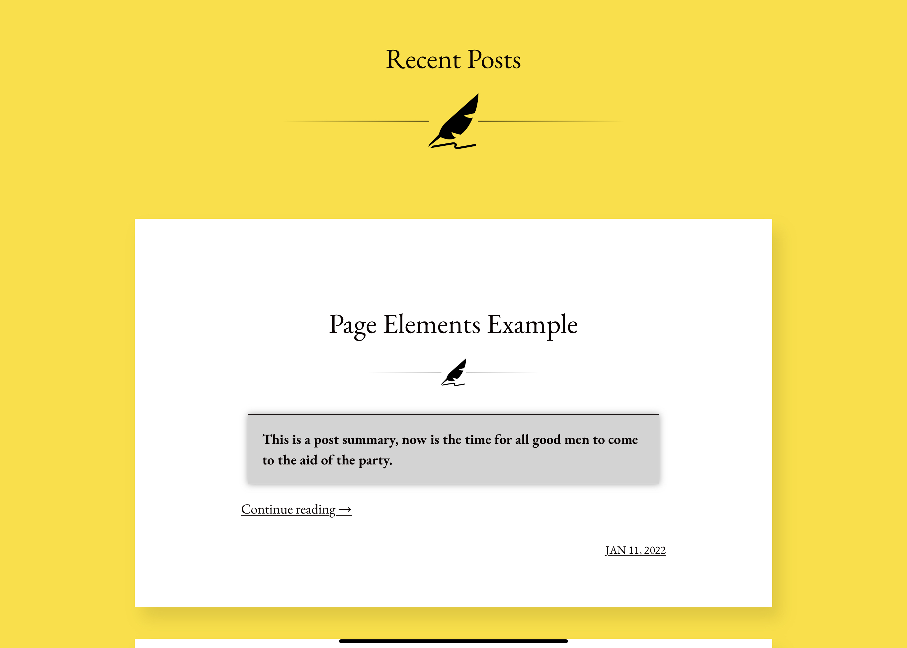
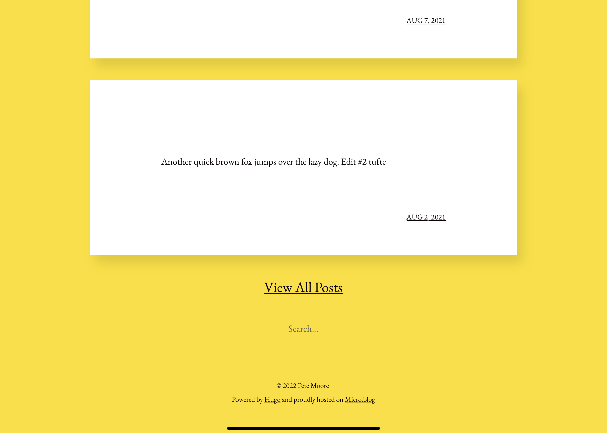
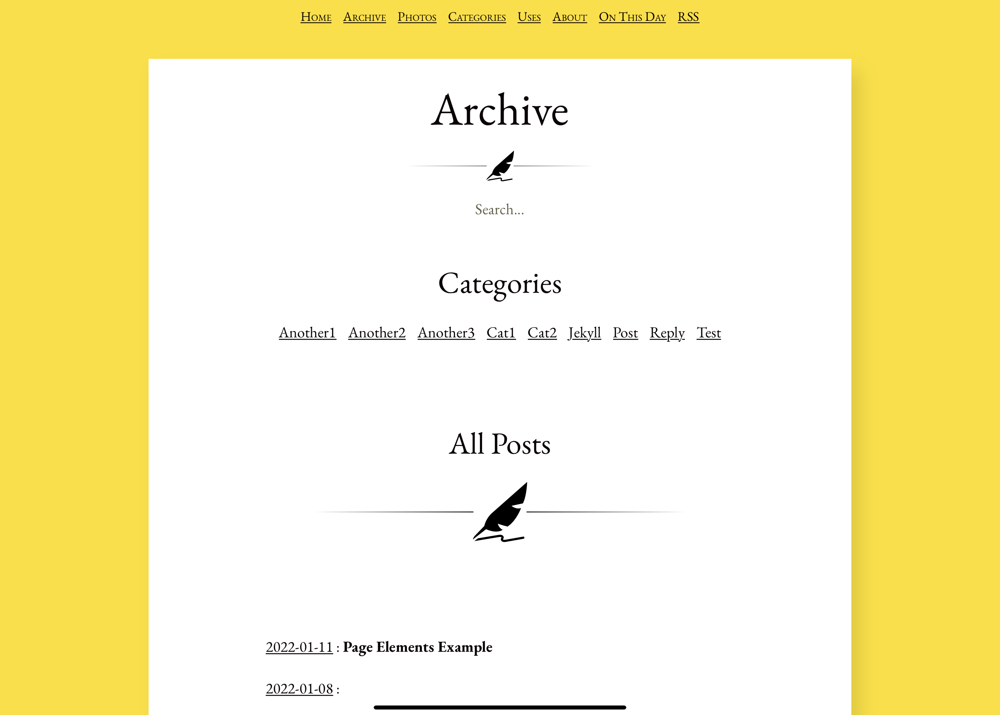

# Hitchens for Micro.blog

**An inarguably well designed theme.  Ported from and based on Hitchens for Jekyll, by Pat Dryburgh**  

## Features

* customizable body and article background, text, divider, dropcap and aside colours using CSS variables
* fully styled Micro.blog conversation elements
* additional styled article elements include:
	* post excerpts
	* dropcaps
	* blockquotes and epigraphs
	* footnotes
	* asides
	* figures
	* divider SVG elements inlined within the CSS itself
	* poetry
* index page includes the 10 most recent posts, with a link below to view the archive
* inline search boxes on both the bottom of the index page, and in the archive
* built-in support for [_Conversation on Micro.blog_](https://github.com/svendahlstrand/plugin-conversation-on-mb) plugin, by @sod
* **there are no shortcodes in this theme**
* no dark mode available as of yet, debating if this theme would work well with one
	
## Walkthroughs

### CSS variables

**Note: at some point I'm going to update this theme to work with Hugo 0.91, which has SASS compiling. These variables and exceptions listed below may change at that point.  These are found near the top of the CSS file in the :root code block**

--body-bg: #fede00;
* the main yellow background colour, also applied in dropcaps and aside top and bottom borders
	
--body-rgba: rgba(254, 222, 0, 1);
* the rgba version of the same background colour, specifically used to designate the middle gradient portion of the aside border
* **if you change the --body-bg colour to something else, you must convert yourself to rgba values and change this variable's value to match (this may change with a SASS capable version of the theme)**
* a good site to to the conversion is [RGBA Color Picker](https://rgbacolorpicker.com/hex-to-rgba)
		
--article-bg: white;
* the background for posts, and content pages
		
--body-text: #0b0404;
* the body text colour used throughout the theme

--article-text: #0b0404;
* the article text used throughout the theme

--excerpt-bg: lightgray;
* the background colour of the post excerpt (if present)

--excerpt-text: #0b0404;
* the text colour of the post excerpt (if present)
		
--highlight: rgb(255, 245, 178);
* a lighter version of the main background colour used as the fill colour for the footnote references
* **this will likely also change with the SASS version, as it has a function to do this**
		
--muted-text: #64644B;
* a lighter version of the main body text used for various elements including the site subtitle, horizontal rules, and post dates
* **this will likely also change with the SASS version, as it has a function to do this**

--font-family: "EB Garamond";
* the theme's inline font, covering normal, normal-italic, bold, bold-italic, and smallcaps versions

--post-shadow: rgba(0, 0, 0, 0.1);
* box shadow specs
	
### Post Excerpts

* the theme offers a post excerpt or summary option for longform titled posts if you choose to add one
* this is controlled by using a custom ```<!--excerpt-->``` tag *along with* the standard ```<!--more-->``` tag
* the theme will check for the presence of this custom tag and use it to format your excerpt differently than the normal truncated text would be

#### Code example

```<!--excerpt-->Type your post excerpt/summary here<!--more-->```

### Dropcaps

* does what it says on the tin: gives the first paragraph letter of long form titled posts (with or without an excerpt) a fancy dropcap letter
* background is in the main yellow colour, and outside stroke the main text colour

### Blockquotes and Epigraphs

* normal blockquotes are typed using the standard markdown
* cites can be added within the quote using the standard ```<cite>cite name</cite>``` tag, and will right align the text within the quote block (which itself is indented slightly on both sides)
* epigraphs are typed using ```<blockquote class="epigraph">quote</blockquote>``` and will style differently from the standard blockquote - useful for entering a special quote that you want to stand out

### Footnotes

* these are normal markdown-based footnotes (**for now** 😉) and use the standard ```[^#]``` inline and ```[^#]: footnote text``` at the foot of the post

### Asides and Figures

* asides are basically like a pullquote that can be used to call attention to a passage of interest in your post:
	```<aside>Type your text here</aside>```

* figures are standard coding style, and can also use captions if you choose:

#### Code Example

```
<figure>
	
	<figcaption>This is an example of a figure caption</figcaption>
</figure>
```
	
### Divider elements

* these are controlled by an inline SVG coded within the CSS elements themselves
* variables (and hex colour values) unfortunately don't work inside the CSS code for these, so the colour needs to be manually changed to the rgb version of whatever --body-text and --article-text colour you're using.
* there are _three_ dividers coded in the CSS:
	- .home .divided::after -- this controls the dividers on the index page
	- .post .divided::after, .archives-page .divided::after, .content-page .divided::after -- this controls the dividers within the articles, archive, and other single content pages
	- .footnotes::before -- this controls the dividers that separate footnotes (if present)
* here's an example of the divider code showing where to customize the colours:

.home .divided::after
	content: "";
	background: url("data:image/svg+xml,%3C%3Fxml version='1.0' encoding='UTF-8' standalone='no'%3F%3E%3C!DOCTYPE svg PUBLIC '-//W3C//DTD SVG 1.1//EN' 'http://www.w3.org/Graphics/SVG/1.1/DTD/svg11.dtd'%3E%3Csvg width='100%25' height='100%25' viewBox='0 0 6000 964' version='1.1' xmlns='http://www.w3.org/2000/svg' xmlns:xlink='http://www.w3.org/1999/xlink' xml:space='preserve' xmlns:serif='http://www.serif.com/' style='fill-rule:evenodd%3Bclip-rule:evenodd%3Bstroke-linejoin:round%3Bstroke-miterlimit:2%3B'%3E%3Cg transform='matrix(1 0 0 1 1517.96 0)'%3E%3Cg transform='matrix(1 0 0 1 1000 0)'%3E%3Cpath d='M850.662 877.56C849.892 877.697 846.29 878.342 840.436 879.391C609.568 920.77 567.099 927.875 562.333 928.428C550.963 929.747 542.469 929.079 536.357 926.386C532.539 924.704 530.471 922.662 529.919 921.763C530.187 920.166 532.218 916.358 533.458 914.033C534.665 911.77 536.032 909.207 537.23 906.475C545.175 888.345 539.616 869.954 522.72 858.476C510.121 849.919 493.416 846.446 473.054 848.151C460.899 849.17 247.836 884.889 130.801 904.588L73.356 949.763C207.324 927.151 462.549 884.33 475.978 883.028C487.974 882.021 497.333 883.545 503.052 887.428C506.373 889.685 506.046 890.431 505.172 892.425C504.516 893.922 503.573 895.689 502.576 897.56C498.741 904.749 493.489 914.594 495.228 926.789C497.135 940.163 506.981 951.69 522.242 958.415C530.822 962.195 540.669 964.069 552.088 964.069C556.596 964.069 561.349 963.777 566.364 963.195C575.547 962.13 669.835 945.525 846.608 913.841C852.429 912.798 856.011 912.155 856.777 912.02C866.293 910.332 872.638 901.248 870.949 891.731C869.26 882.214 860.183 875.87 850.662 877.56Z' style='fill:**rgb(11, 4, 4)**%3Bfill-rule:nonzero%3Bstroke:**rgb(11, 4, 4)**%3Bstroke-width:2px%3B'/%3E%3C/g%3E%3Cg transform='matrix(1 0 0 1 1000 0)'%3E%3Cpath d='M231.14 707.501L82.479 863.005C66.106 880.132 54.573 901.299 49.06 924.343L260.147 758.342C326.228 787.645 379.013 796.979 419.467 796.979C490.54 796.979 523.532 768.153 523.532 768.153C457.368 733.723 447.94 669.467 447.94 669.467C498.615 690.891 604.175 716.145 604.175 716.145C744.361 622.582 817.625 420.007 817.625 420.007C803.11 423.997 789.23 425.659 776.15 425.659C710.355 425.659 665.15 383.529 665.15 383.529L848.294 343.644C909.186 218.71 915.01 0 915.01 0L358.176 495.258C295.116 551.344 250.776 625.424 231.14 707.501Z' style='fill:**rgb(11, 4, 4)**%3Bfill-rule:nonzero%3Bstroke:**rgb(11, 4, 4)**%3Bstroke-width:2px%3B'/%3E%3C/g%3E%3Cg transform='matrix(1.77562 0 0 1 -1678.05 0)'%3E%3Cg transform='matrix(0.563184 -0 -0 1 90.157 -0)'%3E%3C/g%3E%3Cpath d='M114.839 482L1535.87 482' style='fill:none%3Bstroke:url(%23_Linear1)%3Bstroke-width:13.88px%3Bstroke-linecap:round%3Bstroke-miterlimit:1.5%3B'/%3E%3C/g%3E%3Cg transform='matrix(1.77562 0 0 1 1711.1 0)'%3E%3Cg transform='matrix(0.563184 -0 -0 1 -1818.56 0)'%3E%3C/g%3E%3Cpath d='M114.839 482L1535.87 482' style='fill:none%3Bstroke:url(%23_Linear2)%3Bstroke-width:13.88px%3Bstroke-linecap:round%3Bstroke-miterlimit:1.5%3B'/%3E%3C/g%3E%3C/g%3E%3Cdefs%3E%3ClinearGradient id='_Linear1' x1='0' y1='0' x2='1' y2='0' gradientUnits='userSpaceOnUse' gradientTransform='matrix(1421.03 0 0 1421.03 114.839 482)'%3E%3Cstop offset='0' style='stop-color:**rgb(11, 4, 4)**%3Bstop-opacity:0'/%3E%3Cstop offset='1' style='stop-color:**rgb(11, 4, 4)**%3Bstop-opacity:1'/%3E%3C/linearGradient%3E%3ClinearGradient id='_Linear2' x1='0' y1='0' x2='1' y2='0' gradientUnits='userSpaceOnUse' gradientTransform='matrix(1421.03 0 0 1421.03 114.839 482)'%3E%3Cstop offset='0' style='stop-color:**rgb(11, 4, 4)**%3Bstop-opacity:1'/%3E%3Cstop offset='1' style='stop-color:**rgb(11, 4, 4)**%3Bstop-opacity:0'/%3E%3C/linearGradient%3E%3C/defs%3E%3C/svg%3E") no-repeat 50%;
	display: flex;
	justify-content: center;
	height: 2em;
	margin: .5em;

### Poetry

* poetry posts need the dropcaps to be disabled, otherwise they mess with the alignment
* adding a custom ```<!--poetry-->``` comment before the poetry post content will ensure the div element receives a different ID and will **not** have dropcaps

### Manual Dropcaps
* added manual dropcap class
* if you want to start a post with an image(s)--say a featured image--the normal dropcaps won't work
* to target the _first_ paragraph after the image(s) with a dropcap, type the following: ```<p class="dropcap">first paragraph goes here</p>```

### Search

* the theme uses a partial based on the code from the Micro.blog search plugin, without having to have the plugin actually installed
* styling is set to match that of the original Hitchens theme, with results that will drop down
* available near the bottom of the index and top of the archive

## built-in plugin support
* support in the layout and styling for the following plugins has been built-in to Hitchens, and will take affect automatically as long as the plugin is installed
	- Reply by Email, by @sod -- shows a customizable link to allow people to reply to your post via email
	- Conversation on Micro.blog, by @sod -- shows a customizable link to allow people to reply to your post via Micro.blog
	- Surprise Me!, by @sod -- shows in a new footer menu, along with RSS & JSON feed links, and a Micro.blog user link
	- Post Stats, by @amit -- centered info on page, and added extra spacing at top and bottom, also changed font and border colors to use --article-text
	
## On This Day support
* based on the plugin by @cleverdevil, with custom code added to work and style properly with Hitchens
* requires setting up a new custom "On This Day" page and setting it to display in your navigation, then inserting the following code into the page content:

```
<div id="on-this-day">
  <div class="center">Loading...</div>
</div>

<script>
var container = document.getElementById('on-this-day');

function renderPost(post) {
    var postEl = document.createElement('article');
    postEl.className = 'post h-entry';
    container.appendChild(postEl);
    
    if (post['properties']['name'] != null) {
        var dividedEl = document.createElement('div');
        dividedEl.className = 'divided';
        postEl.appendChild(dividedEl);
        var titleEl = document.createElement('h1');
        titleEl.className = 'content-title';
        titleEl.innerText = post['properties']['name'][0];
        dividedEl.appendChild(titleEl);
    }

    var contentEl = document.createElement('div');
    contentEl.className = 'post-content e-content';
    contentEl.innerHTML = post['properties']['content'][0]['html'];
    postEl.appendChild(contentEl);

    var postmetaEl = document.createElement('div');
    postmetaEl.className = 'post-meta';
    contentEl.appendChild(postmetaEl);    

    var postdateEl = document.createElement('div');
    postdateEl.className = 'article-post-date';
    postmetaEl.appendChild(postdateEl);

    var permalinkEl = document.createElement('a');
    permalinkEl.className = 'permalink u-url';
    permalinkEl.href = post['properties']['url'][0];
    postdateEl.appendChild(permalinkEl);

    var publishedEl = document.createElement('time');
    publishedEl.className = 'dt-published';
    publishedEl.datetime = post['properties']['published'][0];

    var published = post['properties']['published'][0];
    published = new Date(published.slice(0,19).replace(' ', 'T'));

    publishedEl.innerText = published.toDateString();
    permalinkEl.appendChild(publishedEl);
}

function renderNoContent() {
    var noPostsEl = document.createElement('div');
	noPostsEl.className = 'center';
    noPostsEl.innerText = 'No posts found for this day. Check back tomorrow!';
    container.appendChild(noPostsEl);
}

var xhr = new XMLHttpRequest();
xhr.responseType = "json";
xhr.open('GET', "https://micromemories.cleverdevil.io/posts?tz=America/Toronto", true);
xhr.send();

xhr.onreadystatechange = function(e) {
    if (xhr.readyState == 4 && xhr.status == 200) {
        container.innerHTML = '';
        if (xhr.response.length == 0) {
            renderNoContent();
        } else {
            xhr.response.forEach(function(post) {
                renderPost(post);
            });
        }
    }
}
</script>
```
* **be sure to change the timezone setting to the correct one for you**

## Installing the theme
	
_Hitchens_ is available as a full plugin on Micro.blog.  Before installing _Hitchens_ be sure to remove any custom CSS, other theme plugins, and set your template to blank.  Then save the changes, after which you can install the plugin for this theme.  If things aren't working or displaying properly, you may have to remove **all plugins** first, save the changes and install _Hitchens_, then add back the other plugins.  Once the theme is successfully installed, you can configure the subtitle and mailto parameters as explained below:
	
### Changing the "subtitle" and "description" parameters in config.json
	
_Hitchens_ includes a configurable subtitle, as well as site description.  Once you've installed the theme plugin on your account per the above instructions, these parameters can be adjusted in the plugin settings.  These new parameter values should be kept anytime the plugin receives an update to its codebase.
	
## Screenshots

### Index





### Search


### Post Page


### Content Page


### Archives



## Credits

* Pat Dryburgh for originally creating this beautiful theme for Jekyll
	Blog: https://patdryburgh.com
	Github: https://github.com/patdryburgh/hitchens
* Manton Reece (@manton on Micro.blog) for creating the Micro.blog platform, as well as the Search Plugin
* W3Schools and numerous other references that help make me look and feel like less of a noob

## Ported to Micro.blog by

Pete Moore

* Blog: https://pimoore.ca
* Github: https://github.com/pimoore

## License

Licensed under the MIT License. See the [LICENSE](https://github.com/pimoore/microdotblog-hitchens/blob/main/LICENSE.md) file for more details.